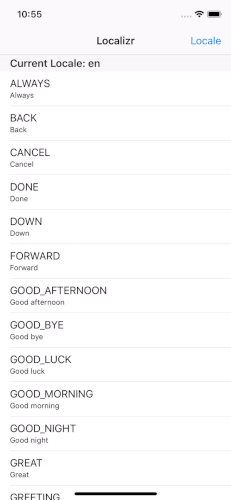

# Localizr.swift

[](https://travis-ci.org/michaelhenry/Localizr.swift)
[](https://cocoapods.org/pods/Localizr.swift)
[](https://cocoapods.org/pods/Localizr.swift)
[](https://cocoapods.org/pods/Localizr.swift)



## Example

To run the example project, clone the repo, and run `pod install` from the Example directory first.

## Requirements

## Installation

Localizr.swift is available through [CocoaPods](https://cocoapods.org). To install
it, simply add the following line to your Podfile:

```ruby
pod 'Localizr.swift'
```

## Author

Michael Henry Pantaleon, me@iamkel.net

## License

Localizr.swift is available under the MIT license. See the LICENSE file for more info.
